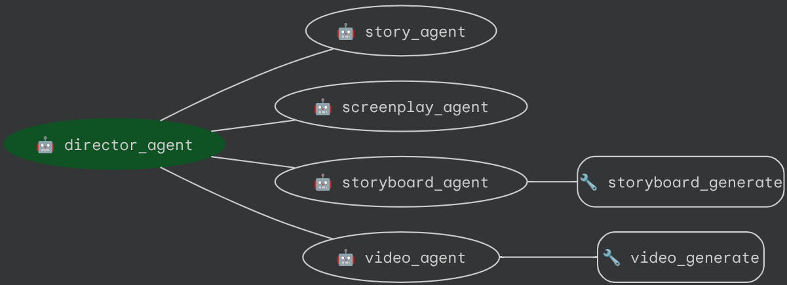

# Ting Ting Episode Agents

ADK multi-agent pipeline that produces short **Ting Ting** preschool learning episodes (ages 1.5–7, "Learn, Sing & Play!") from a single episode topic (e.g. "Let's Count 1 to 5 with balloons"). All output is stored **locally** under `output/<session_id>/` — no GCS.

- [director agent](app/agent.py) - showrunner: orchestrates and quality-checks every stage against the Ting Ting checklist
- [story agent](app/story_agent.py) - episode concept: learning objective, tiny story, original song lyrics, timed beat list
- [screenplay agent](app/screenplay_agent.py) - scene-by-scene screenplay (durations, dialogue/lyrics, narrator lines, on-screen numbers)
- [storyboard agent](app/storyboard_agent.py) - Gemini image keyframes + Gemini vision QC (verifies exact object counts)
- [video agent](app/video_agent.py) - Veo 3 scene clips (native music + character voices, keyframe-seeded for character consistency, optional narrator mixed in)
- [post-production agent](app/post_production_agent.py) - ffmpeg master: gentle crossfades, number overlays, brand intro/outro, loudness-normalized local MP4

Brand style, character sheet (Ting Ting, Bobo, Mimi) and model/output configuration live in [app/tingting_brand.py](app/tingting_brand.py); models and paths can be overridden via `TINGTING_*` variables in `.env`.

Optional: place pre-rendered `intro.mp4` / `outro.mp4` in `assets/brand/` and they will be automatically added to every episode.

> **Requirement:** `ffmpeg` and `ffprobe` must be on PATH for audio mixing and final assembly.

Diagram:



## Changelog

See [Changelog.md](Changelog.md).

## Project Structure

This project is organized as follows:

```
short-movie-agents/
├── app/                 # Core application code
│   ├── agent.py         # Main agent logic
│   ├── server.py        # FastAPI Backend server
│   └── utils/           # Utility functions and helpers
├── Makefile             # Makefile for common commands
├── GEMINI.md            # AI-assisted development guide
└── pyproject.toml       # Project dependencies and configuration
```

## Requirements

Before you begin, ensure you have:
- **uv**: Python package manager (used for all dependency management in this project) - [Install](https://docs.astral.sh/uv/getting-started/installation/) ([add packages](https://docs.astral.sh/uv/concepts/dependencies/) with `uv add <package>`)
- **Google Cloud SDK**: For GCP services - [Install](https://cloud.google.com/sdk/docs/install)
- **make**: Build automation tool - [Install](https://www.gnu.org/software/make/) (pre-installed on most Unix-based systems)


## Quick Start (Local Testing)

Install required packages and launch the local development environment:

```bash
cp .env-template .env
vim .env # Uncomment and update the environment variables
make install && make playground
```

## Commands

| Command              | Description                                                                                 |
| -------------------- | ------------------------------------------------------------------------------------------- |
| `make install`       | Install all required dependencies using uv                                                  |
| `make playground`    | Launch local development environment with backend and frontend - leveraging `adk web` command.|
| `make backend`       | Deploy agent to Cloud Run |
| `make local-backend` | Launch local development server |
| `make test`          | Run unit and integration tests                                                              |
| `make lint`          | Run code quality checks (codespell, ruff, mypy)                                             |
| `uv run jupyter lab` | Launch Jupyter notebook                                                                     |

For full command options and usage, refer to the [Makefile](Makefile).


## Usage

This template follows a "bring your own agent" approach - you focus on your business logic, and the template handles everything else (UI, infrastructure, deployment, monitoring).

1. **Integrate:** Update the agent by editing files in `app` folder.
1. **Test:** Explore your agent functionality using the Streamlit playground with `make playground`. The playground offers features like chat history, user feedback, and various input types, and automatically reloads your agent on code changes.
1. **Deploy:** Refer to the [deployment section](#deployment) for comprehensive instructions.
5. **Monitor:** Track performance and gather insights using Cloud Logging, Tracing, and the Looker Studio dashboard to iterate in your application.

The project includes a `GEMINI.md` file that provides context for AI tools like Gemini CLI when asking questions about the project.


## Deployment

### Dev Environment

You can test deployment towards a Dev Environment using the following command:

```bash
cp .env-template .env
vim .env # Uncomment and update the environment variables
gcloud config set project <your-dev-project-id>
make backend
```


## Monitoring and Observability
> You can use [this Looker Studio dashboard](https://lookerstudio.google.com/reporting/46b35167-b38b-4e44-bd37-701ef4307418/page/tEnnC
) template for visualizing events being logged in BigQuery. See the "Setup Instructions" tab to getting started.

The application uses OpenTelemetry for comprehensive observability with all events being sent to Google Cloud Trace and Logging for monitoring and to BigQuery for long term storage.

### Disclaimer

This list is not an official Google product. Links on this list also are not necessarily to official Google products.

Initial agent structure was generated with [`googleCloudPlatform/agent-starter-pack`](https://github.com/GoogleCloudPlatform/agent-starter-pack) version `0.15.4`.

